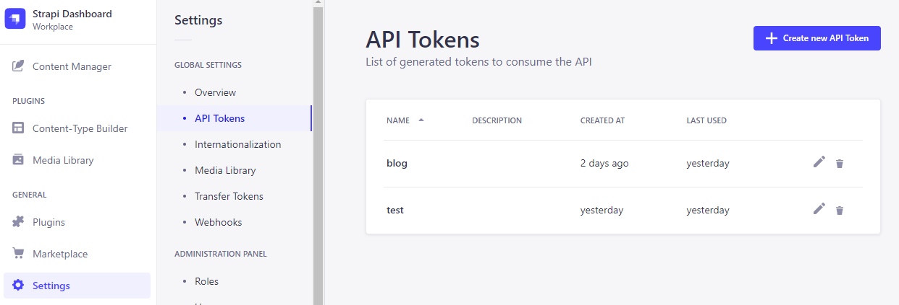
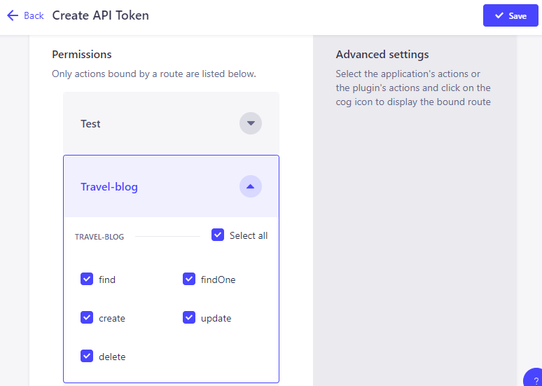
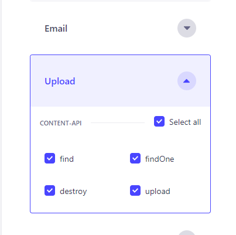
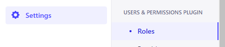
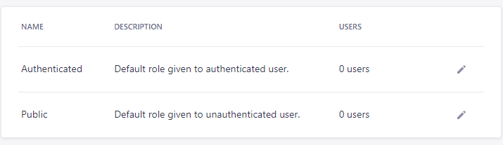

# Blog App

Este es un proyecto de una aplicación de blog desarrollada utilizando React y ViteJS. La aplicación tiene una interfaz de usuario moderna y utiliza bibliotecas como Material-UI y Axios para proporcionar una experiencia de usuario atractiva y realizar solicitudes HTTP al backend.

## Instalación

1. Clona este repositorio en tu máquina local:

    git clone <https://github.com/danielboliyo/react-blog-strapi>

2. Navega a la carpeta `blog-app`:

    cd blog-app

3. Instala las dependencias utilizando npm:

    npm install

## Ejecución

Una vez que hayas instalado las dependencias, puedes iniciar la aplicación ejecutando el siguiente comando:

    npm run dev

Esto iniciará la aplicación de blog en tu entorno de desarrollo local y podrás acceder a ella a través de tu navegador en la dirección [ http://127.0.0.1:5173/]( http://127.0.0.1:5173/).

## My Project (Strapi API)

Esta carpeta contiene el proyecto de Strapi, que proporciona el backend para la aplicación de blog. Strapi es un sistema de gestión de contenido (CMS) de código abierto basado en Node.js que te permite crear y administrar fácilmente una API RESTful.

## Instalación

1. Navega a la carpeta `my-project`:

cd my-project

2. Instala las dependencias utilizando npm:

npm install

## Ejecución

Una vez que hayas instalado las dependencias, puedes iniciar el proyecto de Strapi ejecutando el siguiente comando:

npm run develop

Esto iniciará el servidor de Strapi y podrás acceder a la API en [http://localhost:1337](http://localhost:1337). Asegúrate de que el servidor de Strapi esté en funcionamiento antes de ejecutar la aplicación de blog.

## Configuración de el proyecto strapi

1. Crea un usuario administrador para el proyecto de Strapi:
    Puedes utilizar cualquier correo electrónico y contraseña para la cuenta, ya que será para el entorno local.:

2. Generar nuevo token de acceso:
    Una vez que hayas creado tu cuenta, inicia sesión en el panel de administración de Strapi. Navega hasta la sección de configuración y genera un nuevo token de acceso. Este token se utilizará para autenticar las solicitudes API. Click en el boton Generate New API Token.

    
    Agregar total acceso a la API en proyectos Travel-blog y Upload, esto para poder subir imagenes a la API. despues click en guardar.
    
    

3. Sustituye el token en el archivo .env.development:
    Abre el archivo .env.development en la carpeta `blog-app` y sustituye el token de acceso generado en el paso anterior. El archivo .env.development debe tener el siguiente aspecto
    [VITE_STRAPPI_CLIENT_ID]

4. Agregar permisos en el apartado USERS & PERMISSIONS PLUGIN:
    
    Agregar permisos de acceso a la API en ambos roles
    
    en los mismos apartados, despues click en guardar.
    
    

## Recursos adicionales

- [Documentación de React](https://reactjs.org/)
- [Documentación de ViteJS](https://vitejs.dev/)
- [Documentación de Material-UI](https://mui.com/)
- [Documentación de Axios](https://axios-http.com/)
- [Documentación de Strapi](https://strapi.io/documentation/)
- [Documentación de React Router](https://reactrouter.com/)

